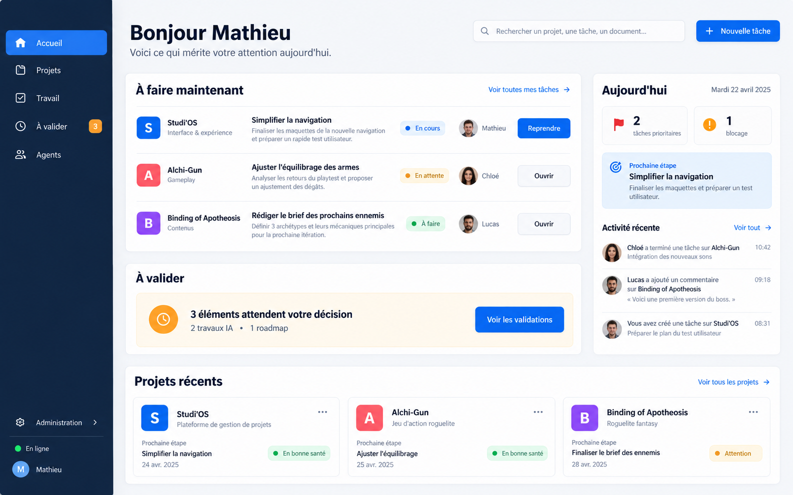
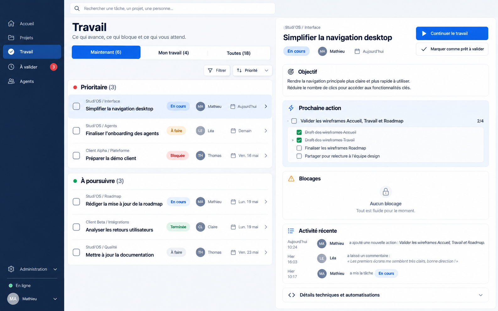
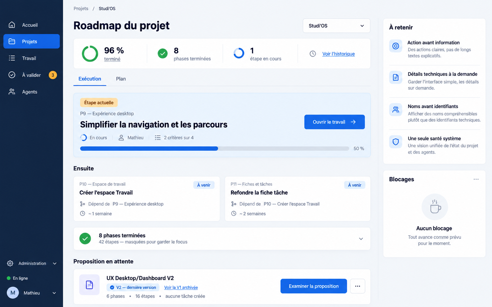

# UX Desktop/Dashboard V2 — dossier de faisabilité

Ce dossier accompagne la roadmap Studi'OS **« UX Desktop/Dashboard V2 — parcours grand public et divulgation progressive »**.

- Roadmap proposée : `47ef8bf2-e26a-4303-95b5-72a137e4a5f3`
- Statut au 3 octobre 2026 : `proposed`
- Structure : 6 phases, 16 étapes, aucune tâche hydratée
- Roadmap remplacée et archivée : `8a4ed9b4-6474-4974-99be-9bff9ceb6343`
- Périmètre exclu : register, login et password

## Objectif

Rendre l'application desktop compréhensible au premier regard : moins d'informations simultanées, une prochaine action évidente, et les détails techniques accessibles à la demande.

Les maquettes sont des **intentions fonctionnelles et de hiérarchie**, pas une spécification pixel-perfect. Les textes, personnes, dates et volumes affichés sont illustratifs. Une évaluation de faisabilité doit confronter chaque intention aux composants, contrats et données réellement disponibles avant toute implémentation.

## Maquettes

### 1. Accueil orienté actions

Intentions à évaluer :

- navigation quotidienne limitée à Accueil, Projets, Travail, À valider et Agents ;
- Administration regroupée et secondaire ;
- un seul indicateur de santé/connexion ;
- trois blocs prioritaires : À faire maintenant, À valider, Projets récents ;
- exploitation du grand écran par une colonne contextuelle utile ;
- noms humains avant identifiants techniques.

Étapes de roadmap principalement concernées : `P02-navigation`, `P03-shell`, `P03-status`, `P05-home-project`.

### 2. Travail et fiche tâche action-first

Intentions à évaluer :

- vues Maintenant, Mon travail et Toutes, avec Maintenant par défaut ;
- liste compacte sans menu de statut répété sur chaque ligne ;
- disposition maître-détail sur écran large ;
- objectif, prochaine action, blocages et validation visibles avant la mécanique ;
- sessions, logs, automatisations, UUID et métadonnées repliés.

Étapes de roadmap principalement concernées : `P03-progressive-components`, `P04-work`, `P04-task-detail`.

### 3. Roadmap centrée sur le présent

Intentions à évaluer :

- étape actuelle et prochaines étapes au-dessus de la ligne de flottaison ;
- phases terminées repliées par défaut ;
- une seule carte par proposition, avec ses révisions regroupées ;
- distinction claire entre Exécution et Plan sans duplication ;
- principes et blocages dans une colonne contextuelle.

Étapes de roadmap principalement concernées : `P04-review`, `P05-roadmaps`.

## Constat de départ observé en Production

L'audit visuel ayant conduit à la V2 a relevé :

- 4 projets visibles ;
- 15 tâches en cours exposées dès l'accueil ;
- 100 tâches chargées dans la liste globale ;
- 50 tâches actives sur le projet Studi'OS ;
- 15 cartes Agents très techniques ;
- deux indications « Connecté » simultanées ;
- proposition de roadmap et révision présentées comme des entrées distinctes ;
- roadmap active à 96 %, mais l'étape courante est repoussée sous 8 phases terminées ;
- espace horizontal sous-exploité sur un affichage 2560 px.

Ces nombres documentent l'état observé, pas des invariants produit.

## Questions de faisabilité à traiter

1. Quelles vues peuvent être recomposées uniquement côté dashboard, sans changement de contrat API ?
2. Les données nécessaires à « Maintenant » et « Mon travail » existent-elles déjà, ou faut-il ajouter des filtres/agrégats côté API ?
3. Le maître-détail peut-il réutiliser les vues et routes actuelles sans dupliquer leur état ?
4. Quels composants communs peuvent porter la divulgation progressive des UUID, sessions, logs et automatisations ?
5. La file À valider peut-elle dédoublonner et regrouper les révisions avec les contrats actuels ?
6. Le modèle de roadmap expose-t-il assez d'information pour épingler l'étape courante et replier le passé ?
7. Comment conserver l'accès rapide aux surfaces expertes sans maintenir deux navigations concurrentes ?
8. Quels tests existants couvrent le shell, les routes, les listes, la fiche tâche et la roadmap ?
9. Quels changements sont purement visuels, lesquels touchent un contrat, et lesquels nécessitent une migration de données ?
10. Quel découpage permet un déploiement progressif et un retour arrière sans perte d'état utilisateur ?

## Livrable attendu de la prochaine session

Produire une note de faisabilité liée aux 16 étapes de la roadmap avec, pour chaque étape :

- composants et fichiers probables ;
- réutilisation possible versus nouveau composant ;
- impact API, contrat ou modèle de données ;
- dépendances et risques ;
- effort révisé S/M/L ;
- stratégie de test ;
- possibilité de livraison incrémentale et rollback.

Ne pas implémenter pendant cette évaluation. Les contrats et décisions validées priment sur les maquettes en cas de conflit.

## Fichiers

- `baseline.md` — état initial mesuré des 4 parcours
- `targets.md` — cibles de simplification vérifiables (C1–C4)
- `mockups/01-home.png`
- `mockups/02-work-task.png`
- `mockups/03-roadmap.png`

